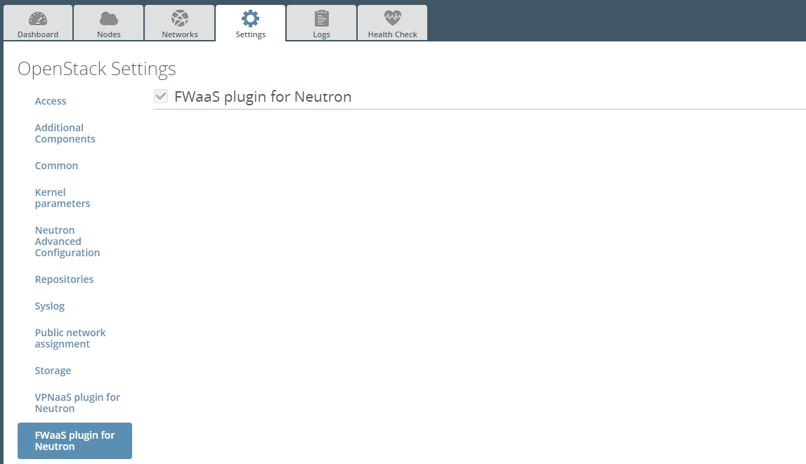

Installation Guide
==================

Installing FWaaS plugin
-----------------------

1. Download the plug­in from `Fuel Plugins Catalog <https://software.mirantis.com/download-mirantis-openstack-fuel-plug-ins/>`_.

2. Copy the plug­in on already installed Fuel Master node::

.. code:: bash

   [user@home ~]$ scp fwaas-plugin-2.0-2.0.0-0.noarch.rpm root@:<the_Fuel_Master_node_IP>:~/

3. Log into the Fuel Master node. Install the plugin::

.. code:: bash

   [root@fuel ~]# fuel plugins --install fwaas-plugin-2.0-2.0.0-0.noarch.rpm

4. Verify that the plugin is installed correctly::

.. code:: bash

   [root@fuel ~]# fuel plugins --list
   id | name         | version | package_version
   ---|--------------|---------|----------------
   1  | fwaas_plugin | 2.0.0   | 2.0.0

Creating Environment with FWaaS
-------------------------------

1. After plug­in is installed, create a new OpenStack environment with Neutron.

2. `Configure your environment <http://docs.mirantis.com/openstack/fuel/fuel-7.0/user-guide.html#configure-your-environment/>`_.

3. Open the Settings tab of the Fuel web UI and scroll down the page. Select
   FWaaS plugin checkbox::

4. `Deploy your environment <http://docs.mirantis.com/openstack/fuel/fuel-7.0/user-guide.html#deploy-changes/>`_.

